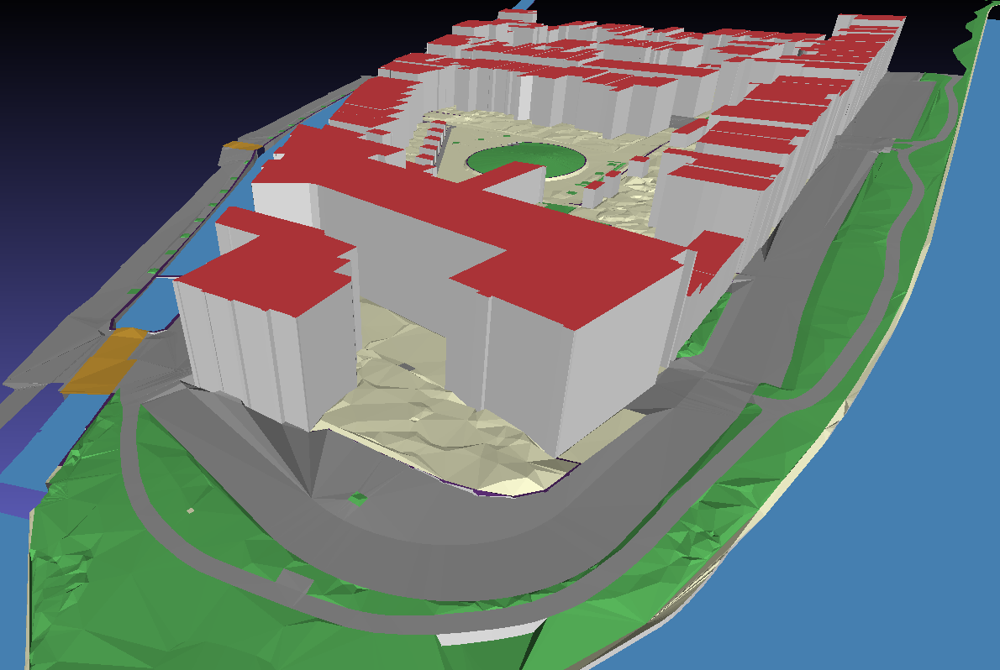
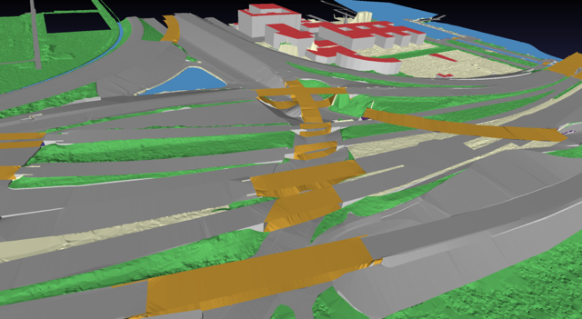

# Inleiding

3D-stadsmodellen (en 3D terreinmodellen) worden steeds meer gebruikt bij het plannen en beheren van onze leefomgeving. Recente ontwikkelingen in technieken voor het inwinnen van 3D-hoogte-informatie, LiDAR en fotogrammetrie, hebben het relatief eenvoudig gemaakt om 3D-stadsmodellen automatisch te reconstrueren en deze data te gebruiken voor bijvoorbeeld planning en omgevingssimulaties. 

De huidige 3D stadsmodellen die door verschillende organisaties worden geproduceerd, verschillen echter nog steeds sterk vanwege verschillen in acquisitiemethoden, verschillen in applicaties waarvoor de 3D-gegevens worden ingewonnen, verschillen in datastructuren, formaten enz.

Daarom verschillen 3D-stadsmodellen (die meer omvatten dan 3D-gebouwen) vaak sterk van elkaar. Bovendien is er doorgaans geen plan om de eenmaal gegenereerde gegevens actueel te houden. Het gevolg is dat 3D-stadsmodellen geen deel uitmaken van de reguliere gegevensinfrastructuren en deze gegevens worden daardoor nog steeds onvoldoende gebruikt in besluitvormingsprocessen van de overheid.

Om actuele 3D-gegevens over grootschalige topografie uniform beschikbaar te hebben voor diverse overheidsprocessen, zou deze, vanuit technisch oogpunt, het beste kunnen worden ingewonnen als onderdeel van de BGT en BAG en de verantwoordelijkheid zijn van al deze verschillende bronhouders. Maar op dit moment is het niet haalbaar en ook niet wenselijk voor alle BAG en BGT bronhouders om aanvullende 3D-gegevens te verzamelen.

Daarom heeft het Kadaster een 3D basisvoorziening ingericht om, vooruitlopend op een 3D BAG/BGT in de (verre) toekomst, actuele 3D gegevens voor heel Nederland beschikbaar te stellen. In deze voorziening worden 3D basisgegevens gereconstrueerd op basis van BGT en BAG. Dit gebeurt op een volledig automatische wijze. De 3D gegevens worden landsdekkend gereconstrueerd en beschikbaar gesteld in de open standaard CityJSON via PDOK. De 3D basisvoorziening die we in zomer 2020 beschikbaar stellen, is gebaseerd op zowel puntenwolken gegenereerd uit luchtfoto’s (inwin jaar 2018) als AHN3 (ingewonnen tussen 2014 en 2019). De 3D basisvoorziening zorgt ook voor beheer en periodieke updates, die aansluit op andere informatie-initiatieven zoals Dis-Geo en de Samenhangende Object Registratie (SOR).

Dit is een eerste versie van het 3D Basisbestand Volledig. We zijn benieuwd naar de gebruikerservaringen en de mogelijke onvolkomenheden om het bestand te verbeteren.

## De 3D Basisvoorziening

De 3D Basisvoorziening bestaat uit drie producten die allemaal automatisch worden gegenereerd:

1. het 3D Basisbestand Volledig (combinatie van LoD1.2 gebouwen + terrein (en bruggen))
1. het  3D Basisbestand Gebouwen (LoD1.3, met daaraan gekoppeld attributen die de kwaliteit van ieder gebouwmodel beschrijven)
1. het 3D Hoogtestatistieken Gebouwen

<aside class="note">LoD (Level of Detail) beschrijft  het detailniveau waarop de hoogte van gebouwen beschikbaar is. Dit wordt in figuur 3 nader toegelicht.</aside>

<figure>
    <figcaption>visualisatie van data uit het 3D Basisbestand Volledig</figcaption>
    
</figure>

Het product 3D Basisbestand Volledig (een combinatie van LoD1.2 gebouwen + terrein (en bruggen)) dat nu beschikbaar is, bestaat uit terreinvlakken, gegenereerd uit BGT maaiveld-objecten met in het terrein geïntegreerde gebouwen.

<figure>
    <figcaption>gereconstrueerde brugvlakken</figcaption>
    
</figure>

De gebouwen in dit product worden gegenereerd door de BAG-geometrie van het gebouw op te trekken tot een enkele hoogte, d.w.z. de zogenaamde LoD1.2-weergave, zie onderstaande figuur. 

<figure>
    <figcaption>Levels of Detail voor gebouwen ( F. Biljecki, yyyy)</figcaption>
    
</figure>

Het horizontale grondvlak van de gebouwmodellen is altijd ingesteld op het laagste snijpunt met het maaiveld om te voorkomen dat het gebouw gaat zweven.
De twee andere producten worden later dit jaar beschikbaar gesteld. Het 3D Basisbestand Gebouwen bevat blok-modellen waarbij aanzienlijke hoogtesprongen binnen een gebouw in het model worden onderscheiden (conform LoD1.3). Denk bijvoorbeeld aan een kerk met met een toren of een huis met een aangebouwde schuur.

Het product 3D Hoogtestatistieken Gebouwen bevat de 2D BAG-geometrieën van gebouwen waaraan verschillende hoogte-waarden zijn toegekend. Deze verschillende hoogte-waarden representeren verschillende referentiehoogten die berekend worden op basis van verschillende statistische parameters van de hoogtepunten die zich binnen een BAG polygoon bevinden. Afhankelijk van de toepassing kan een gebruiker beslissen welke referentiehoogte moet worden gebruikt om het 3D model te reconstrueren. Het bestand 3D Hoogtestatistieken Gebouwen komt zowel voor LoD1.2 als voor LoD1.3 beschikbaar. In dat laatste geval is de geometrie opgeknipt in verschillende delen op basis van hoogtesprongen.
