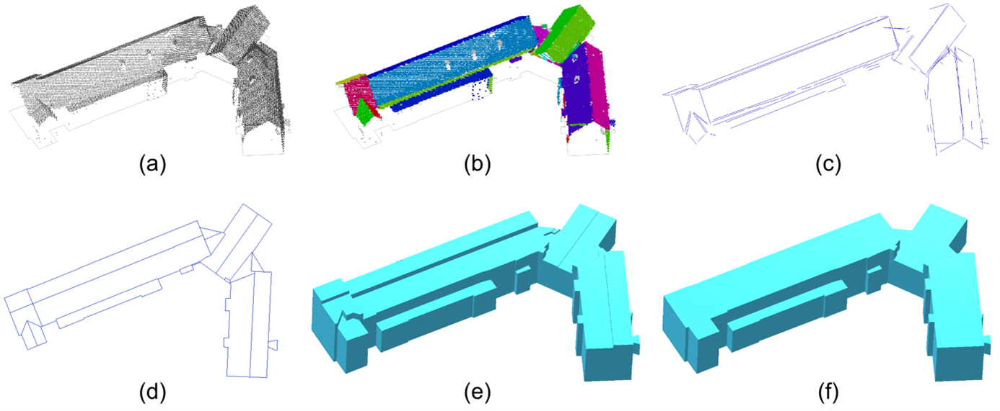

# Methodes van inwinning, voorbewerking en reconstructie

Voor het reconstrueren van de 3D data is gebruik gemaakt van 2D geometrieën uit de BAG en BGT en van hoogtegegevens die verkregen zijn uit puntenwolken. Voor het vervaardigen van puntenwolken zijn luchtfoto’s uit de winter van 2020 gebruikt. Aangezien bronhouders van de BGT en de BAG ook gebruik maken van deze luchtfoto’s om hun bestanden te actualiseren, hebben we een latere peildatum voor de BAG en BGT gekozen. Dit zorgt voor een zo klein mogelijk actualiteitsverschil tussen de hoogtegegevens en 2D geometrieën. Zie Tabel 1 voor meer informatie.

**Tabel 1:** actualiteit en toepassing van de brondata

Brondata|Toepassing|Peildatum / inwinperiode
--------|----------|------------------------
BGT|Terrein|01-01-2021
BAG|Gebouwen|01-01-2021
Luchtfoto's|hoogtegegevens|winter 2020
Luchtfoto's |infraroodgegevens ten behoeve classificatie van hoge vegetatie|zomer 2020

## Voorbewerking van BAG en BGT
Om de objecten uit de BAG en de BGT als input te kunnen gebruiken voor het automatische reconstructieproces zijn een aantal voorbewerkingen uitgevoerd. Hierbij werden de objecten gevalideerd en verrijkt met informatie. Waar nodig werden de geometrieën van de objecten geïntegreerd met de geometrie van omliggende objecten. Hierbij moet worden opgemerkt dat niet alle geometrische bewerkingen correcties zijn op de BGT, maar dat het gaat om het geschikt maken van de data voor het 3D reconstructieproces. Hierdoor zijn de 2D objecten niet altijd meer dezelfde als in de oorspronkelijke BGT en BAG. 

De belangrijkste geometrische bewerkingen zijn:
- Het verwijderen van self-intersecties (polygonen of lijnen die zichzelf doorkruizen) en arcs (bogen).
- Het verwijderen van dubbele objecten waarbij zoveel mogelijk het nieuwste object behouden is
- het op elkaar aansluiten ('snappen') van geometrische objecten die elkaar raken (hoek, overlap of gedeelde grens) waarbij eventueel datapunten worden toegevoegd. Dit wordt gedaan om gaten in het BGT maaiveld dicht te krijgen, maar ook om in de BAG aansluitende panden ook werkelijk te laten aansluiten.
- het uitlijnen van datapunten op een grid ten behoeve van de nauwkeurigheid van alle validaties. Alle resulterende coördinaten worden in millimeters opgeslagen.

Om de geometrische objecten te integreren met hun omgeving worden twee bewerkingen uitgevoerd: 
- De topologie tussen verschillende hoogteniveaus wordt hersteld om 3D reconstructie mogelijk te maken. Hierbij worden waar nodig datapunten op gedeelde grenzen en bij kruisende objecten geïntroduceerd. Dit speelt met name voor overbruggingsdelen en bijzondere objecten.
- Topologische fouten die problemen kunnen veroorzaken in het reconstructieproces, zoals overlappen, gaten, en zgn. spikes (uitschieters), worden opgespoord en automatisch gecorrigeerd. Hierbij worden ongeclassificeerde objecten gecreëerd voor gaten in de BGT.

<aside class='note'>
Voor een goede 3D-reconstructie moeten de overbruggingssituaties voldoen aan <a href='http://imgeo.geostandaarden.nl/def/imgeo-object/overbruggingsdeel/overbruggingsdeel'>de standaard die voor de BGT is voorgeschreven</a>. Bovendien moeten de wegdelen op bruggen, die zijn gemodelleerd boven het maaiveld, aansluiten op de wegdelen die op maaiveldhoogte zijn gemodelleerd.</aside>

## Het genereren van de puntenwolken
Voor de reconstructie van 2D naar 3D zijn hoogtegegevens nodig voor twee dingen: voor de hoogtebepaling van BAG-panden, en voor de hoogtebepaling van de maaiveldobjecten (BGT). Deze hoogte wordt verkregen door het toepassen van [semi-global matching](https://en.wikipedia.org/wiki/Semi-global_matching) op de stereofoto’s die ingewonnen worden in de [landelijke voorziening beeldmateriaal](https://www.beeldmateriaal.nl/). Deze voorziening koopt voor de overheidspartijen in Nederland landsdekkend beeldmateriaal in voor het bijhouden van de basisregistraties BAG, BGT en de Basisregistratie Topografie (BRT). Voor de hoogtebepaling uit beeldmateriaal worden de stereofoto’s van de wintervlucht gebruikt. 

**Tabel 2:** Kenmerken stereofoto’s 2020

Kenmerk|waarde|toelichting
-------|------|-----------
Ground Sampling Distance (GSD)|5-10,8cm
Overlap in de strook|60% (deels 80%)
Overlap tussen de stroken|30%
Vlieghoogte|1500-4300m

De nauwkeurigheid van de resulterende hoogte wordt onder andere door de overlap in de strook en de vlieghoogte bepaald.

<aside class='note'>Voor meer technische achtergrondinformatie, zie deze artikelen: 
<ul>
    <li><a href='https://pdfs.semanticscholar.org/1691/09ca918dc5283a0ecf09ac38f7568fc6a0a1.pdf'>Wenzel et al: SURE – The ifp Software for Dense Image Matching</a></li>
    <li><a href='https://en.wikipedia.org/wiki/Computer_stereo_vision'>Wikipedia - Computer stereo vision</a>.</li>
</ul>
</aside>

In een tweede stap wordt er een Digital Surface Model (DSM), een digitaal model van het aardoppervlak van Nederland, gegenereerd op basis van de verkregen puntenwolken. Dit DSM is een 2.5D hoogtemodel dat wordt opgeslagen als een grid met een pixelmaat van 20 centimeter. Elke pixel in dit grid krijgt in principe één hoogtewaarde die wordt bepaald door de meest betrouwbare hoogste waarde te nemen. Voor sommige pixels is het echter niet mogelijk om de hoogtewaarde vast te stellen (bijvoorbeeld door reflectie op water of schaduwen op een gebouw). Voor deze pixels wordt geen interpolatie toegepast. Hierdoor bevat elke vierkante meter van het DSM maximaal 25 hoogtewaarden.

Als laatste stap wordt het DSM automatisch geclassificeerd in de categorieën `gebouw`, `water`, `bruggen`, `hoge vegetatie`, `ground` en de restcategorie `not classified`. Hierbij wordt voor water en bruggen gebruik gemaakt van BGT polygonen en voor gebouwen van BAG polygonen. Voor de classificatie van `hoge vegetatie` is gebruik gemaakt van de infraroodgegevens van de lage resolutie zomervlucht van de Landelijke Voorziening Beeldmateriaal. In bosgebieden, waar het maaiveld niet automatisch kan worden gedetecteerd, wordt data uit het AHN gebruikt. De categorie `ground` (ook wel aan te duiden met Digital Terrain Model (DTM)) wordt uitgedund naar 4 punten per vierkante meter.

Na deze stappen is de puntenwolk geschikt als input voor de 3dfier software, zodat 3D geometrieën uit de 2D geometrieën van de BAG/BGT kunnen worden gegenereerd.

## 3D reconstructie met 3dfier
Voor het toekennen van hoogte aan de BGT maaiveldobjecten gebruiken we de open source software [3dfier](http://tudelft3d.github.io/3dfier/) (versie 1.3). Deze software is ontwikkeld in een samenwerking tussen [Kadaster](https://www.kadaster.nl/) en de [3D geoinformation](https://3d.bk.tudelft.nl) vakgroep van de [TU Delft](https://www.tudelft.nl/) en kan voor verschillende scenario’s ingezet worden. 

<aside class='note'>De gebruikte 3dfier configuratie voor de reconstructie van het 3D Basisbestand is opgenomen in <a href="#bijlage-gebruikte-parameters-voor-3dfier">bijlage A</a>.</aside>

De software genereert automatisch 3D-representaties op basis van 2D-topografie en puntenwolken en houdt daarbij ook rekening met de semantiek van elke polygoon. De opgetrokken polygonen worden aan elkaar "gestikt" zodat één digitaal oppervlaktemodel wordt gereconstrueerd.

<aside class='note'>Zie voor verdere details <a href='http://tudelft3d.github.io/3dfier/'>http://tudelft3d.github.io/3dfier/</a></aside>

<figure>
    
    <figcaption>een landsdekkend waterdicht terreinmodel met gebouwvolumes</figcaption>
</figure>

Hiermee wordt een landsdekkend waterdicht (i.e. aansluitend) 3D terreinmodel verkregen, zonder overlap en gaten, waarbij BGT-gebouwen geïntegreerd zijn in het maaiveld. Dit 3D terreinmodel kan vervolgens worden gebruikt als input voor bijvoorbeeld simulatiesoftware.

De LoD1.2 gebouwen zijn gereconstrueerd op basis van hun BAG geometrie en de 3D puntenwolk, waarbij een maximale en minimale hoogte is gebruikt om een 3D volumegeometrie te construeren. De maximale hoogte is bepaald op basis van het 90 percentiel van de hoogtepunten die binnen een BAG geometrie vallen. Om te voorkomen dat gebouwen boven het maaiveld zweven wordt het laagste punt in het maaiveld dat door de BAG geometrie geraakt wordt gebruikt voor de bepaling van de hoogte van het grondvlak. 

## LoD1.3 reconstructie
Bij de LoD1.3 reconstructie worden dakdelen met verschillende hoogtes gedetecteerd en als zodanig opgetrokken. Hierbij wordt een drempel hoogtesprong gebruikt van 3 meter, omdat dit ongeveer gelijk wordt geacht aan een verdieping.

<figure>
    
    <figcaption>de verschillende stappen in de LoD1.3 reconstructie methode</figcaption>
</figure>

Het LoD1.3 reconstructieproces gebeurt via de volgende stappen (zie ook Figuur 5)

1.	Selecteer de hoogtepunten boven het BAG-polygoon. Hierbij worden alleen de punten gebruikt die als gebouw zijn geclassificeerd in de puntenwolk.
1. 	Detecteer vlakken in de puntenwolk met behulp van een ‘region-growing’ algoritme om alle dakvlakken te identificeren. Dit is een vrij standaard algoritme, zoals bijvoorbeeld beschreven (als "surface growing") in [[Vosselman2010]]. In deze stap worden ook punten verwijderd die zich op een muurvlak (gevel) bevinden of geen deel uitmaken van een vlak;
1. 	Detecteer de omlijning van de dakvlakken met behulp van [α-shapes](https://doc.cgal.org/latest/Alpha_shapes_3/index.html) en een ‘region-growing’ lijndetectie-algoritme op de α-shape omlijning;
1. 	Splits de BAG-polygoon op in dakdelen met behulp van de lijnen uit stap 3. De lijnen worden eerst geregulariseerd en dan samengevoegd met het BAG polygoon om tot een 2D-planaire partitie van het BAG-polygoon te komen. Deze partitie wordt vervolgens geoptimaliseerd met een methode die lijkt op die van Zebedin [[Zebedin2008]]. Het doel van deze optimalisatie is het behalen van een zo eenvoudig mogelijke opsplitsing die tegelijkertijd een zo klein mogelijke afwijking ten opzichte van de puntenwolk heeft.
1. 	Trek elk dakdeel op tot zijn mediale hoogte.
1.	Verwijder hoogtesprongen die kleiner zijn dan 3 meter.

Voor deze reconstructie is gebruik gemaakt van het AHN3. Verder zijn de volgende opmerkingen van toepassing: 
- Delen binnen een BAG polygoon waarvoor in het AHN3 alleen maaiveldpunten bestaan zijn van het gebouw afgeknipt. Dit komt bijvoorbeeld voor bij ondergrondse garages. 
- Kassen / warenhuizen (uit TOP10NL) en andere grote gebouwen (oppervlakte >100 000 m2) zijn altijd gereconstrueerd in LoD1.2
- Gebouwen die nieuwer zijn dan het AHN zijn gereconstrueerd als LoD1.2 op basis van de puntenwolken uit luchtfoto’s.

